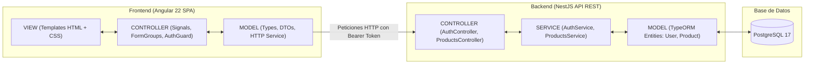

# Aplicación CRUD y Login con Patrón MVC (NestJS + Angular + PostgreSQL)

[](https://nestjs.com/)
[](https://angular.dev/)
[](https://www.postgresql.org/)
[](https://www.docker.com/)
[](https://jwt.io/)

Este repositorio contiene la solución completa de la actividad práctica: **Desarrollo de una Aplicación con Operaciones CRUD y Sistema de Autenticación (Login) aplicando el Patrón MVC**.

---

## 📋 Tabla de Contenidos
1. [Descripción de la Actividad](#-descripción-de-la-actividad)
2. [Cumplimiento de Requisitos](#-cumplimiento-de-requisitos)
3. [Demostración en Video](#-demostración-en-video-máx-3-minutos)
4. [Arquitectura y Patrón MVC](#-arquitectura-y-patrón-mvc)
5. [Tecnologías Utilizadas](#-tecnologías-utilizadas)
6. [Estructura del Proyecto](#-estructura-del-proyecto)
7. [Endpoints de la API](#-endpoints-de-la-api)
8. [Puesta en Marcha](#-puesta-en-marcha)
   * [Opción A: Despliegue con Docker Compose (Recomendado)](#opción-a-despliegue-con-docker-compose-recomendado)
   * [Opción B: Ejecución Local en Desarrollo](#opción-b-ejecución-local-en-desarrollo)
9. [Credenciales de Prueba](#-credenciales-de-prueba)

---

## 🎯 Descripción de la Actividad

El objetivo de la actividad consiste en diseñar e implementar una aplicación web completa y funcional basada en el patrón arquitectónico **MVC (Modelo - Vista - Controlador)**, integrando:

* **Operaciones CRUD**: Crear, Leer, Actualizar y Eliminar sobre una entidad de negocio (Productos).
* **Sistema de Autenticación (Login y Registro)**: Acceso restringido mediante usuario y contraseña a las secciones privadas del sistema.
* **Protección Estricta de URLs**: Impedir cualquier intento de acceso directo a rutas o endpoints protegidos si el usuario no ha iniciado sesión previamente.
* **Seguridad y Encriptación**: Almacenamiento seguro de contraseñas mediante algoritmos de cifrado unidireccional con salting (**Bcrypt**).
* **Entrega en Video**: Grabación demostrativa breve (máximo 3 minutos) en **Loom** o **YouTube** validando todos los flujos solicitados.

---

## ✅ Cumplimiento de Requisitos

| Requisito Exigido en la Actividad | Estado | Implementación en este Proyecto |
| :--- | :---: | :--- |
| **Patrón MVC** | Cumplido | Backend desacoplado en Modelos (TypeORM Entities + DTOs), Controladores REST y Servicios; Frontend con Vistas modulares en Angular, Controladores con Signals y Servicios HTTP. |
| **Operaciones CRUD** | Cumplido | Gestión integral de productos con creación validada, listado con búsqueda y paginación, edición reactiva, cambio de estado (Activo/Inactivo) y eliminación controlada. |
| **Autenticación (Login & Register)** | Cumplido | Módulo de autenticación con emisión de JSON Web Tokens (JWT), validación de credenciales y persistencia de sesión. |
| **URLs y Rutas Protegidas** | Cumplido | **Backend**: `JwtAuthGuard` activo en todos los endpoints de `/api/v1/products`.<br>**Frontend**: `AuthGuard` funcional (`canActivate`) que intercepta la navegación a `/products` y redirige a `/login`. |
| **Encriptación de Contraseñas** | Cumplido | Cifrado con `bcrypt` y factor de costo (salt rounds = 10) antes de almacenar contraseñas en PostgreSQL. Ninguna contraseña se guarda en texto plano. |
| **Video Demostrativo (Máx. 3 min)** | Preparado | Guion estructurado y sección dedicada para incluir el enlace de Loom o YouTube. |

---

## 🎥 Demostración en Video (Máx. 3 minutos)

> 🔗 **Enlace al video de la demostración**:  
> **[Ver Video Demostrativo en Loom / YouTube](https://www.loom.com/)** *(Reemplazar con el enlace de grabación final)*

### Guion de Verificación Paso a Paso Grabado:

1. **Intento de Acceso a Ruta Protegida sin Autenticación**:
   * En modo incógnito, se navega directamente a `http://localhost:4200/products`.
   * El `AuthGuard` intercepta la petición, verifica la ausencia de token y redirige de inmediato a `http://localhost:4200/login`.
2. **Registro de un Nuevo Usuario**:
   * Acceso a la vista de registro (`/register`).
   * Creación de cuenta indicando nombre, correo electrónico y contraseña (demostrando la validación del formulario).
3. **Inicio de Sesión (Login) y Validación Criptográfica**:
   * Ingreso de credenciales en `/login`.
   * Verificación del hash con `bcrypt` en backend y recepción del Bearer Token JWT.
   * Redirección exitosa hacia la vista privada protegida `/products`.
4. **Demostración de las 4 Operaciones CRUD**:
   * **Crear (Create)**: Apertura del modal *"Nuevo Producto"*, ingreso de datos (código, nombre, categoría, precio, stock, descripción) y guardado en tiempo real.
   * **Leer (Read)**: Visualización de la tabla de productos, filtro de búsqueda por texto y paginación.
   * **Actualizar (Update)**: Modificación de campos (precio, nombre, stock) mediante el modal de edición.
   * **Cambiar Estado**: Alternancia entre estado *Activo* e *Inactivo* mediante modal de confirmación.
   * **Eliminar (Delete)**: Eliminación física de un producto con modal de advertencia y actualización del listado.
5. **Cierre de Sesión (Logout) y Bloqueo de Historial**:
   * Clic en el botón *"Cerrar Sesión"*.
   * Limpieza del token en el cliente y redirección a `/login`.
   * Intento de volver a la vista protegida con el botón "Atrás" del navegador; el sistema bloquea el acceso inmediatamente.

---

## 🏗 Arquitectura y Patrón MVC

La solución aplica el patrón **Model-View-Controller (MVC)** de forma moderna y limpia dividida entre el ecosistema servidor y cliente:



* **Modelo (Model)**:
  * **Backend**: Entidades TypeORM (`User`, `Product`) mapeadas contra tablas de PostgreSQL, con decoradores `class-validator` en los DTOs para garantizar integridad de datos.
  * **Frontend**: Interfaces y tipos estrictos de TypeScript (`auth.types.ts`, `products.types.ts`).
* **Controlador (Controller)**:
  * **Backend**: `AuthController` gestiona las rutas de registro y login; `ProductsController` procesa las peticiones de creación, listado paginado, búsqueda, actualización y borrado.
  * **Frontend**: Clases de componentes que orquestan el estado mediante **Angular Signals** (`signal()`, `computed()`), reaccionan a eventos de usuario y administran el flujo de navegación.
* **Vista (View)**:
  * Componentes Standalone de Angular con templates HTML semánticos y estilos CSS encapsulados, sin dependencias de librerías CSS pesadas, con soporte responsive (Flexbox / CSS Grid).

---

## 🛠 Tecnologías Utilizadas

### Backend
* **Node.js** & **TypeScript**
* **NestJS 11**: Framework modular y estructurado.
* **TypeORM**: Mapeador objeto-relacional para PostgreSQL.
* **PostgreSQL 17**: Motor de base de datos relacional.
* **Passport JWT**: Estrategia de autenticación con tokens portadores.
* **Bcrypt**: Hashing seguro de contraseñas con salting.
* **Class-Validator & Class-Transformer**: Validación y sanitización estricta de DTOs.

### Frontend
* **Angular 22 (Standalone Components)**: Arquitectura moderna sin `NgModule`.
* **Angular Signals**: Reactividad declarativa de alto rendimiento (`signal`, `computed`).
* **Angular Router & CanActivate Functional Guards**: Protección de navegación cliente.
* **HTTP Interceptors**: Adjunto automático del token `Bearer` en peticiones salientes.
* **CSS Nativo Modular**: Diseño responsive personalizado con variables CSS, Grid y Flexbox.

### DevOps y Contenedores
* **Docker & Dockerfile**: Imágenes multi-stage optimizadas para backend y frontend.
* **Docker Compose**: Orquestación de servicios en red unificada (`postgres_db`, `backend`, `frontend`).
* **Nginx**: Servidor web ligero para servir los archivos estáticos de la SPA Angular en producción.

---

## 📁 Estructura del Proyecto

```text
crud_login/
├── docker-compose.yml             # Orquestación integral de DB, Backend y Frontend
├── README.md                      # Documentación completa del proyecto
├── .gitignore                     # Exclusión de node_modules, dist, logs, etc.
│
├── backend/                       # API REST con NestJS
│   ├── Dockerfile                 # Contenedor de backend
│   ├── src/
│   │   ├── auth/                  # Módulo de Autenticación
│   │   │   ├── dto/               # LoginUserDto, RegisterUserDto
│   │   │   ├── entities/          # User (id, name, email, password, status)
│   │   │   ├── guards/            # JwtAuthGuard
│   │   │   ├── strategies/        # JwtStrategy (Passport)
│   │   │   ├── auth.controller.ts # Endpoints /api/v1/auth
│   │   │   └── auth.service.ts    # Lógica de login, registro y bcrypt
│   │   ├── products/              # Módulo CRUD de Productos
│   │   │   ├── dto/               # CreateProductDto, UpdateProductDto, FilterProductDto
│   │   │   ├── entities/          # Product (id, code, name, description, price, stock, status)
│   │   │   ├── products.controller.ts # Endpoints /api/v1/products (Protegidos)
│   │   │   └── products.service.ts    # Lógica de negocio CRUD
│   │   ├── config/                # database.config.ts
│   │   ├── app.module.ts          # Módulo raíz de NestJS
│   │   └── main.ts                # Bootstrap, CORS y ValidationPipe global
│   └── package.json
│
└── frontend/                      # Cliente SPA con Angular 22
    ├── Dockerfile                 # Contenedor de frontend con Nginx
    ├── nginx.conf                 # Configuración de Nginx para rutas SPA
    ├── src/
    │   ├── app/
    │   │   ├── core/
    │   │   │   ├── auth/          # AuthService, AuthGuard, AuthInterceptor
    │   │   │   └── products/      # ProductsService, ProductsTypes
    │   │   ├── pages/
    │   │   │   ├── auth/
    │   │   │   │   ├── login/     # Formulario de inicio de sesión
    │   │   │   │   └── register/  # Formulario de registro de usuario
    │   │   │   └── products/
    │   │   │       ├── products-list/ # Listado con búsqueda y paginador
    │   │   │       └── modals/        # Modales: crear, editar, cambiar estado
    │   │   ├── app.routes.ts      # Definición de rutas con protección AuthGuard
    │   │   └── app.config.ts      # Configuración de providers e interceptores
    │   └── styles.css             # Paleta de colores y estilos globales
    └── package.json
```

---

## 🔌 Endpoints de la API

Prefijo base: `http://localhost:3000/api/v1`

### 1. Autenticación (`/auth`)
| Método | Endpoint | Acceso | Descripción |
| :---: | :--- | :---: | :--- |
| `POST` | `/auth/register` | **Público** | Registra un nuevo usuario encriptando la contraseña con Bcrypt. |
| `POST` | `/auth/login` | **Público** | Autentica las credenciales y retorna el JWT Bearer Token. |
| `GET` | `/auth/profile` | 🔒 **Privado (JWT)** | Obtiene la información del usuario autenticado. |

### 2. Gestión de Productos CRUD (`/products`)
| Método | Endpoint | Acceso | Descripción |
| :---: | :--- | :---: | :--- |
| `GET` | `/products` | 🔒 **Privado (JWT)** | Obtiene el listado de productos paginado y filtrado. |
| `GET` | `/products/:id` | 🔒 **Privado (JWT)** | Obtiene el detalle de un producto por su identificador. |
| `POST` | `/products` | 🔒 **Privado (JWT)** | Crea un nuevo producto validando sus campos con DTO. |
| `PUT` | `/products/:id` | 🔒 **Privado (JWT)** | Actualiza los datos de un producto existente. |
| `PATCH` | `/products/:id/status` | 🔒 **Privado (JWT)** | Modifica el estado del producto (`ACTIVE` / `INACTIVE`). |
| `DELETE`| `/products/:id` | 🔒 **Privado (JWT)** | Elimina físicamente un producto de la base de datos. |

---

## 🚀 Puesta en Marcha

### Opción A: Despliegue con Docker Compose (Recomendado)

Con un solo comando se levantan los 3 servicios integrados: PostgreSQL 17, Backend NestJS y Frontend Angular con Nginx:

```bash
docker compose up --build -d
```

Una vez levantados los contenedores:
* **Frontend Web**: [http://localhost:4200](http://localhost:4200)
* **Backend API REST**: [http://localhost:3000/api/v1](http://localhost:3000/api/v1)
* **PostgreSQL**: `localhost:5433` (Base de datos: `crud_login_db`)

Para detener los servicios:
```bash
docker compose down
```

---

### Opción B: Ejecución Local en Desarrollo

Si prefieres ejecutar el proyecto localmente sin Docker para los entornos de desarrollo:

#### 1. Iniciar la Base de Datos PostgreSQL
Asegúrate de tener PostgreSQL ejecutándose en el puerto `5433` con una base de datos llamada `crud_login_db`, o levanta solo la base de datos con Docker:
```bash
docker compose up postgres_db -d
```

#### 2. Configurar e Iniciar el Backend (NestJS)
```bash
cd backend

# Instalar dependencias
npm install

# Iniciar en modo desarrollo
npm run start:dev
```
El servidor backend se inicializará en `http://localhost:3000/api/v1`. Las tablas se sincronizan automáticamente con TypeORM.

#### 3. Iniciar el Frontend (Angular)
En una segunda terminal:
```bash
cd frontend

# Instalar dependencias
npm install

# Iniciar servidor de desarrollo de Angular
npm start
```
Abre tu navegador en [http://localhost:4200](http://localhost:4200).

---

## 🔑 Credenciales de Prueba

Para agilizar la evaluación de la actividad, puedes registrar un nuevo usuario desde la interfaz o utilizar la cuenta predeterminada:

* **Correo Electrónico**: `admin@demo.com`
* **Contraseña**: `Admin123!`
* **Estado**: `Activo`

---

## 👨‍💻 Autor
* **Estudiante**: Derick Tipan
* **Carrera / Especialidad**: Desarrollo de Software / Arquitectura Web
* **Materia / Actividad**: Aplicación CRUD y Login con Patrón MVC
